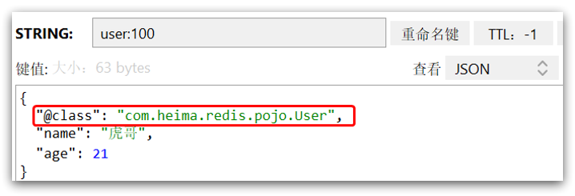

## Jedis

Jedis 的官网地址：https://github.com/redis/jedis

引入依赖：

```xml
<dependency>
    <groupId>redis.clients</groupId>
    <artifactId>jedis</artifactId>
    <version>3.7.0</version>
</dependency>
```

建立连接

```Java
private Jedis jedis;

@BeforeEach
void setUp(){
    //建立连接
    jedis = new Jedis("192.168.230.128",6379);
    //设置密码
    jedis.auth("0411");
    //选择库
    jedis.select(0);
}
```

测试 String

```Java
@Test
void testString(){
    //插入数据，方法名称就是redis命令名称
    String result = jedis.set("name","张三");
    System.out.println("result = " + result);
    //获取数据
    String name = jedis.get("name");
    System.out.println("name = " + name);
}

//释放资源
@AfterEach
void tearDown(){
    if(jedis != null){
        jedis.close();
    }
}
```

## Jedis 连接池

Jedis 本身是线程不安全的，并且频繁的创建和销毁连接会有性能损耗，因此用 jedis 连接池代替 jedis 的直连方式

```Java
public class JedisConnectionFactory{
    private static final JedisPool jedisPool;

    static{
        JedisPoolConfig jedisPoolConfig = new JedisPoolConfig();
        //最大连接
        jedisPoolConfig.setMaxTotal(8);
        //最大空闲连接
        jedisPoolConfig.setMaxIdle(8);
        //最小空闲连接
        jedisPoolConfig.steMinIdle(0);
        //设置最长等待时间，ms
        jedisPoolConfig.setMaxWaitMillis(200);
        jedisPool = new JedisPool(jedisPoolConfig,"192.168.230.128",6379,1000,"0411" );
    }
    //获取Jedis对象
    public static Jedis getJedis(){
        return jedisPool.getResource();
    }
}
```

## SpringDataRedis

SpringData 是 Spring 中数据操作的模块，包含对各种数据库的集成，其中对 Redis 的集成模块就叫做 SpringDataRedis，官网地址：https://spring.io/projects/spring-data-redis

- 提供了对不同 Redis 客户端的整合（Lettuce 和 Jedis）
- 提供了 RedisTemplate 统一 API 来操作 Redis
- 支持 Redis 的发布订阅模型
- 支持 Redis 哨兵和 Redis 集群
- 支持基于 Lettuce 的响应式编程
- 支持基于 JDK、JSON、字符串、Spring 对象的数据序列化及反序列化
- 支持基于 Redis 的 JDKCollection 实现

SpringDataRedis 中提供了 RedisTemplate 工具类，其中封装了各种对 Redis 的操作。并且将不同数据类型的操作 API 封装到了不同的类型中：


## SpringDataRedis 快速入门

1、引入依赖

```xml
<!--Redis依赖-->
<dependency>
    <groupId>org.springframework.boot</groupId>
    <artifactId>spring-boot-starter-data-redis</artifactId>
</dependency>
<!--连接池依赖-->
<dependency>
    <groupId>org.apache.commons</groupId>
    <artifactId>commons-pool2</artifactId>
</dependency>
```

2、配置文件

```yaml
spring:
  redis:
    host: 192.168.150.101
    port: 6379
    password: 123321
    lettuce:
      pool:
        max-active: 8
        max-idle: 8
        min-idle: 0
        max-wait: 100ms
```

3、注入 RedisTemplate

```java
@Autowired
private RedisTemplate redisTemplate;
```

4、编写测试

```java
@SpringBootTest
public class RedisTest{
    @Autowired
    private RedisTemplate redisTemplate;

    @Test
    void testString(){
        //插入一条string类型数据
        redisTemplate.opsForValue().set("name","李四");
        //读取一条string类型的数据
        Object name = redisTemplate.opsForValue().get("name");

        System.out.println("name = "+name);
    }
}
```

## 自定义序列化

RedisTemplate 可以接收任意 Object 作为值写入 Redis：


只不过写入前会把 Object 序列化为字节形式，默认是采用 JDK 序列化，得到的结果是这样的：


缺点：

- 可读性差
- 内存占用较大

我们可以自定义 RedisTemplate 的序列化方式，代码如下：

```java
@Configuration
public class RedisConfig {

    @Bean
    public RedisTemplate<String, Object> redisTemplate(RedisConnectionFactory connectionFactory){
        // 创建RedisTemplate对象
        RedisTemplate<String, Object> template = new RedisTemplate<>();
        // 设置连接工厂
        template.setConnectionFactory(connectionFactory);
        // 创建JSON序列化工具
        GenericJackson2JsonRedisSerializer jsonRedisSerializer =
            							new GenericJackson2JsonRedisSerializer();
        // 设置Key的序列化
        template.setKeySerializer(RedisSerializer.string());
        template.setHashKeySerializer(RedisSerializer.string());
        // 设置Value的序列化
        template.setValueSerializer(jsonRedisSerializer);
        template.setHashValueSerializer(jsonRedisSerializer);
        // 返回
        return template;
    }
}
```

这里采用了 JSON 序列化来代替默认的 JDK 序列化方式。最终结果如图：



整体可读性有了很大提升，并且能将 Java 对象自动的序列化为 JSON 字符串，并且查询时能自动把 JSON 反序列化为 Java 对象。不过，其中记录了序列化时对应的 class 名称，目的是为了查询时实现自动反序列化。这会带来额外的内存开销。

## StringRedisTemplate

为了节省内存空间，我们可以不使用 JSON 序列化器来处理 value，而是统一使用 String 序列化器，要求只能存储 String 类型的 key 和 value。当需要存储 Java 对象时，手动完成对象的序列化和反序列化。


因为存入和读取时的序列化及反序列化都是我们自己实现的，SpringDataRedis 就不会将 class 信息写入 Redis 了。

这种用法比较普遍，因此 SpringDataRedis 就提供了 RedisTemplate 的子类：StringRedisTemplate，它的 key 和 value 的序列化方式默认就是 String 方式。


省去了我们自定义 RedisTemplate 的序列化方式的步骤，而是直接使用：

```java
@Autowired
private StringRedisTemplate stringRedisTemplate;
// JSON序列化工具
private static final ObjectMapper mapper = new ObjectMapper();

@Test
void testSaveUser() throws JsonProcessingException {
    // 创建对象
    User user = new User("虎哥", 21);
    // 手动序列化
    String json = mapper.writeValueAsString(user);
    // 写入数据
    stringRedisTemplate.opsForValue().set("user:200", json);

    // 获取数据
    String jsonUser = stringRedisTemplate.opsForValue().get("user:200");
    // 手动反序列化
    User user1 = mapper.readValue(jsonUser, User.class);
    System.out.println("user1 = " + user1);
}

```
