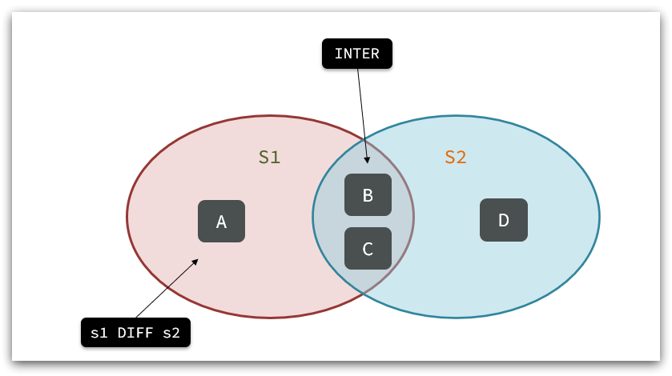

## redis 数据结构

Redis 是一个 key-value 的数据库，key 一般是 String 类型，value 的类型多种多样：

- **String**
- **Hash**
- **List**
- **Set**
- **SortedSet**
- **GEO**
- **BitMap**
- **HyperLog**

redis 默认有 16 个库 可以通过**SELECT**命令来选中需要操作的数据库。

## Redis 常用命令

可以从官方网站 https://redis.io/commands 查看详细的命令
也可以在命令行中通过**help [commands]** 查看命令的使用方法

常用的有：

- **KEYS** : 查看符合模板的所有 key
- **DEL** : 删除一个指定的 key
- **EXIST** : 判断 key 是否存在
- **EXPIRE** : 给一个 key 设置有效期，有效期到期时该 key 会被自动删除
- **TTL** : 查看一个 key 的剩余有效期

## String 类型

String 类型，也就是字符串类型，是 Redis 中最简单的存储类型 其中 value 是字符串，不过根据字符串的格式的不同，可以分为三类：

- **string** : 普通字符串
- **int** : 整数类型，可以做自增，自减操作
- **float** : 浮点类型，可以做自增，自减操作

不管是哪种类型，底层都是**字节数组**形式存储，只不过是编码方式不同，字符串类型的最大空间不能超过 512m，常见命令有：

- **SET** : 添加或者修改已经存在的有一个 String 类型的键值对
- **GET** : 根据 key 获取 String 类型的键值对
- **MSET** : 批量添加多个 String 类型的键值对
- **MGET** : 根据多个 key 获取多个 String 类型的 value
- **INCR** : 让一个整型的 key 自增 1
- **INCRBY** : 让一个整型的 key 自增并指定步长
- **INCRBYFLOAT** : 让一个浮点类型的数字自增并指定步长
- **SETNX** : 添加一个 String 类型的键值对，前提是这个 key 不存在，否则不执行
- **SETEX** : 添加一个 String 类型的键值对，并指定有效期

## key 的层次结构

Redis 的 key 允许有多个单词形成层级结构，多个单词之间用':'隔开，格式如下：

> **项目名:业务名:类型:id**

格式并不固定，可以根据需求来进行更改

## Hash 类型

Hash 类型，也叫散列，其 value 是一个无序字典，类似于 Java 中的 HashMap 结构

String 结构是将对象序列化为 JSON 字符串后存储，当需要修改对象的某个字段时很不方便
| KEY | VALUE |
|:-------:|:-------:|
| test:user:1 | {name:"test1",age:"22"} |
| test:user:2 | {name:"test1",age:"22"} |

Hash 结构可以将对象中的每个字段独立存储，可以针对单个字段做 CRUD

Hash 的常见命令有：

- **HSET key field value**：添加或者修改 hash 类型 key 的 field 的值

- **HGET key field**：获取一个 hash 类型 key 的 field 的值

- **HMSET**：批量添加多个 hash 类型 key 的 field 的值

- **HMGET**：批量获取多个 hash 类型 key 的 field 的值

- **HGETALL**：获取一个 hash 类型的 key 中的所有的 field 和 value
- **HKEYS**：获取一个 hash 类型的 key 中的所有的 field
- **HINCRBY**:让一个 hash 类型 key 的字段值自增并指定步长
- **HSETNX**：添加一个 hash 类型的 key 的 field 值，前提是这个 field 不存在，否则不执行

## List 类型

Redis 中的 List 类型与 Java 中的 LinkedList 类似，可以看做是一个双向链表结构。既可以支持正向检索和也可以支持反向检索。

特征也与 LinkedList 类似：

- **有序**
- **元素可以重复**
- **插入和删除快**
- **查询速度一般**

常用来存储一个有序数据，例如：朋友圈点赞列表，评论列表等。

List 的常见命令有：

- **LPUSH key element ...** ：向列表左侧插入一个或多个元素
- **LPOP key**：移除并返回列表左侧的第一个元素，没有则返回 nil
- **RPUSH key element ...** ：向列表右侧插入一个或多个元素
- **RPOP key**：移除并返回列表右侧的第一个元素
- **LRANGE key star end**：返回一段角标范围内的所有元素
- **BLPOP 和 BRPOP**：与 LPOP 和 RPOP 类似，只不过在没有元素时等待指定时间，而不是直接返回 nil

## Set 类型

Redis 的 Set 结构与 Java 中的 HashSet 类似，可以看做是一个 value 为 null 的 HashMap。因为也是一个 hash 表，因此具备与 HashSet 类似的特征：

- 无序

- 元素不可重复

- 查找快

- 支持交集、并集、差集等功能

Set 的常见命令有：

- SADD key member ... ：向 set 中添加一个或多个元素
- SREM key member ... : 移除 set 中的指定元素
- SCARD key： 返回 set 中元素的个数
- SISMEMBER key member：判断一个元素是否存在于 set 中
- SMEMBERS：获取 set 中的所有元素
- SINTER key1 key2 ... ：求 key1 与 key2 的交集

例如两个集合：s1 和 s2:

求交集：SINTER s1 s2

求 s1 与 s2 的不同：SDIFF s1 s2

## SortedSet 类型

Redis 的 SortedSet 是一个可排序的 set 集合，与 Java 中的 TreeSet 有些类似，但底层数据结构却差别很大。SortedSet 中的每一个元素都带有一个 score 属性，可以基于 score 属性对元素排序，底层的实现是一个跳表（SkipList）加 hash 表。

SortedSet 具备下列特性：

- 可排序
- 元素不重复
- 查询速度快

因为 SortedSet 的可排序特性，经常被用来实现排行榜这样的功能。

SortedSet 的常见命令有：

- ZADD key score member：添加一个或多个元素到 sorted set ，如果已经存在则更新其 score 值
- ZREM key member：删除 sorted set 中的一个指定元素
- ZSCORE key member : 获取 sorted set 中的指定元素的 score 值
- ZRANK key member：获取 sorted set 中的指定元素的排名
- ZCARD key：获取 sorted set 中的元素个数
- ZCOUNT key min max：统计 score 值在给定范围内的所有元素的个数
- ZINCRBY key increment member：让 sorted set 中的指定元素自增，步长为指定的 increment 值
- ZRANGE key min max：按照 score 排序后，获取指定排名范围内的元素
- ZRANGEBYSCORE key min max：按照 score 排序后，获取指定 score 范围内的元素
- ZDIFF、ZINTER、ZUNION：求差集、交集、并集

注意：所有的排名默认都是升序，如果要降序则在命令的 Z 后面添加 REV 即可，例如：

- **升序**获取 sorted set 中的指定元素的排名：ZRANK key member

- **降序**获取 sorted set 中的指定元素的排名：ZREVRANK key memeber
