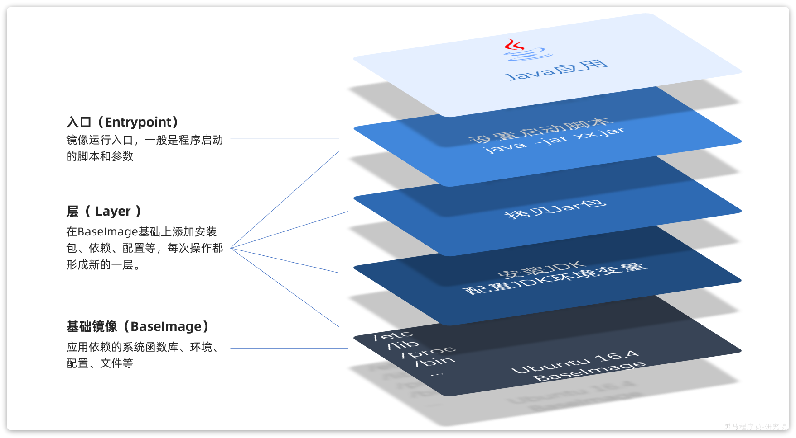

# docker 学习笔记

## docker 介绍

Docker 是一个开源的应用容器引擎，让开发者可以打包他们的应用以及依赖包到一个可移植的镜像中，然后发布到任何流行的 Linux 或 Windows 操作系统的机器上，也可以实现虚拟化。容器是完全使用沙箱机制，相互之间不会有任何接口。

> **镜像(image)：** 包含应用本身 以及应用运行所需要的环境、配置、系统函数库 <br> **容器(container)：** 运行镜像时的一个隔离环境 <br>

可以在 [docker 官方镜像仓库](https://hub.docker.com) 中获取 docker 镜像
<br><br><br>

## docker 常用命令

- `docker run`：创建并运行一个容器 -d 让容器在后台运行 --name 给容器取名 -p 设置端口映射 -e 配置容器内进程运行时的一些参数

示例：

```shell
    docker run -d
    --name mysql
    -p 3306:3306
    -e TZ=Asia/Shanghai
    -e MYSQL_ROOT_PASSWORD=123
    mysql
```

- `docker pull`：从镜像仓库拉取镜像到本地
- `docker push`：推送镜像到 DockerRegistry
- `docker images`：查看本地镜像
- `docker rmi`：删除本地镜像
- `docker run`：创建并运行容器（不能重复创建）
- `docker stop`：停止指定容器
- `docker start`：启动指定容器
- `docker restart`：重新启动容器
- `docker rm`：删除指定容器
- `docker ps`：查看容器
- `docker exec`：进入容器
- `docker save`：保存镜像到本地压缩文件
- `docker load`：加载本地压缩文件到镜像
- `docker inspect`：查看容器详细信息
- `docker logs`：查看容器运行日志

用一副图来表示这些命令的关系：


补充：
默认情况下，每次重启虚拟机我们都需要手动启动 Docker 和 Docker 中的容器。通过命令可以实现开机自启：

```
# Docker开机自启
systemctl enable docker

# Docker容器开机自启
docker update --restart=always [容器名/容器id]
```

## 数据卷

容器是隔离环境，容器内程序的文件、配置、运行时产生的容器都在容器内部，我们要读写容器内的文件非常不方便。

- 如果要升级 MySQL 版本，需要销毁旧容器，那么数据岂不是跟着被销毁了？
- MySQL、Nginx 容器运行后，如果我要修改其中的某些配置该怎么办？
- 我想要让 Nginx 代理我的静态资源怎么办？

因此，容器提供程序的运行环境，但是**程序运行产生的数据、程序运行依赖的配置都应该与容器解耦。**

> **数据卷（volume）**是一个虚拟目录，是**容器内目录**与**宿主机目录**之间映射的桥梁。

如图所示其中的关系：


在上图中：

- 我们创建了两个数据卷：conf、html
- Nginx 容器内部的 conf 目录和 html 目录分别与两个数据卷关联。
- 而数据卷 conf 和 html 分别指向了宿主机的/var/lib/docker/volumes/conf/\_data 目录和/var/lib/docker/volumes/html/\_data 目录

这样以来，容器内的 conf 和 html 目录就 与宿主机的 conf 和 html 目录关联起来，我们称为**挂载**。此时，我们操作宿主机的/var/lib/docker/volumes/html/\_data 就是在操作容器内的/usr/share/nginx/html/\_data 目录。只要我们将静态资源放入宿主机对应目录，就可以被 Nginx 代理了。

> /var/lib/docker/volumes 这个目录就是默认的存放所有容器数据卷的目录，其下再根据数据卷名称创建新目录，格式为/数据卷名/\_data<br>
> 不过，我们通过由于数据卷目录比较深，不好寻找，通常我们也允许让容器直接与宿主机目录挂载而不使用数据卷

### 数据卷相关命令

- `docker volume create`：创建数据卷
- `docker volume ls`：查看所有数据卷
- `docker volume rm`：删除指定数据卷
- `docker volume inspect`：查看某个数据卷的详情
- `docker volume prune`：清除数据卷

> 注意：容器与数据卷的挂载要在创建容器时配置，对于创建好的容器，是不能设置数据卷的。而且**创建容器的过程中，数据卷会自动创建。**

### 挂载本地目录或文件

可以发现，数据卷的目录结构较深，如果我们去操作数据卷目录会不太方便。在很多情况下，我们会直接将容器目录与宿主机指定目录挂载。挂载语法与数据卷类似：

```md
# 挂载本地目录

-v 本地目录:容器内目录

# 挂载本地文件

-v 本地文件:容器内文件
```

> 注意：本地目录或文件必须以 / 或 ./开头，如果直接以名字开头，会被识别为数据卷名而非本地目录名。

例如

```md
# 会被识别为一个数据卷叫 mysql，运行时会自动创建这个数据卷

-v mysql:/var/lib/mysql

# 会被识别为当前目录下的 mysql 目录，运行时如果不存在会创建目录

-v ./mysql:/var/lib/mysql
```

## 自定义镜像

镜像之所以能让我们快速跨操作系统部署应用而忽略其运行环境、配置，就是因为镜像中包含了程序运行需要的系统函数库、环境、配置、依赖。<br>
因此，自定义镜像本质就是依次准备好程序运行的基础环境、依赖、应用本身、运行配置等文件，并且打包而成。

我们打包镜像也是分成这么几步：

- 准备 Linux 运行环境（java 项目并不需要完整的操作系统，仅仅是基础运行环境即可）
- 安装并配置 JDK
- 拷贝 jar 包
- 配置启动脚本
  上述步骤中的每一次操作其实都是在生产一些文件（系统运行环境、函数库、配置最终都是磁盘文件），所以镜像就是一堆文件的集合。<br>

但需要注意的是，镜像文件不是随意堆放的，而是按照操作的步骤分层叠加而成，每一层形成的文件都会单独打包并标记一个唯一 id，称为 Layer（层）。这样，如果我们构建时用到的某些层其他人已经制作过，就可以直接拷贝使用这些层，而不用重复制作。<br>
下图可展示一个镜像的结构：


由于制作镜像的过程中，需要逐层处理和打包，比较复杂，所以 Docker 就提供了自动打包镜像的功能。我们只需要将打包的过程，每一层要做的事情用固定的语法写下来，交给 Docker 去执行即可。
而这种记录镜像结构的文件就称为**Dockerfile**，其对应的语法可以参考官方文档：
https://docs.docker.com/engine/reference/builder/

常用语法有：

> - FROM 指定基础镜像
> - ENV 设置环境变量，可在后面指令使用
> - COPY 拷贝本地文件到镜像的指定目录
> - RUN 执行 Linux 的 shell 命令，一般是安装过程的命令
> - EXPOSE 指定容器运行时监听的端口，是给镜像使用者看的
> - ENTRYPOINT 镜像中应用的启动命令，容器运行时调用

当 Dockerfile 文件写好以后，就可以利用命令来构建镜像了。

> `docker build` 构建一个 docker 镜像

## 网络

容器的网络 IP 其实是一个虚拟的 IP，其值并不固定与某一个容器绑定，如果开发时写死某个 IP，而在部署时很可能 MySQL 容器的 IP 会发生变化，连接会失败。

于是，可以使用 docker 的网络功能来解决这个问题，官方文档：https://docs.docker.com/engine/reference/commandline/network/

常见命令有：

- `docker network create` 创建一个网络
- `docker network ls` 查看所有网络
- `docker network rm` 删除指定网络
- `docker network prune` 清除未使用的网络
- `docker network connect` 使指定容器连接加入某网络
- `docker network disconnect` 使指定容器连接离开某网络
- `docker network inspect` 查看网络详细信息

## DockerCompose

部署一个简单的 java 项目，其中包含 3 个容器：

- MySQL
- Nginx
- Java 项目

Docker Compose 就可以帮助我们实现**多个相互关联的 Docker 容器的快速部署**。它允许用户通过一个单独的 docker-compose.yml 模板文件（YAML 格式）来定义一组相关联的应用容器。
详细参考官方文档： https://docs.docker.com/compose/compose-file/compose-file-v3/
